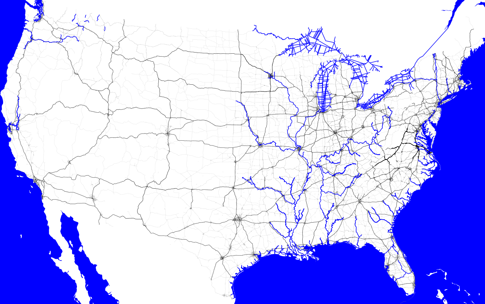

# Transportation Networks

The script, *trasnport.py* combines GIS data on the shape of the contiguous United States, its geographic subdivisions, and its transportation networks to create maps that can be used as inputs when calculating domestic trade costs. The modes of transportation to be mapped are roads, railroads, and navigable waterways. Additionally, a point in space (expressed in the same coordinates as the network) to represent each geographic unit is neccessary to make use of the maps to calculate physical distances between domestic locations. Three geopgraphic units will be considered: Commodity Flow Survery (CFS) Areas, Commuting Zones (CZ), and counties (CTY). 

## Land shape

The shape of the North American continent including and immediately surrounding the contiguous United States (and, inversely, the surrounding seas) is created by combining a shapefile on [international political boundaries from ARCGIS Hub](https://hub.arcgis.com/datasets/a21fdb46d23e4ef896f31475217cbb08_1) with a bounding box created from [the U.S. Census Bureau's county shapefile](https://www.census.gov/geographies/mapping-files/time-series/geo/carto-boundary-file.2010.html). The political boundary map contains shapes for the countries of the world including the U.S., Canada, Mexcio, and Carribean nations. The bounding box is created by first combining the counties of the contiguous United States and then finding the box that just fits this combined shape. Using geopandas, the following code excerpt combines the counties (by creating a new variable that is the same for all shapes *cont_us* and then applying *.dissolve(by='cont_us')*) and calculates the bounding box (using *.envelope*):

```
#combine counties into a single shape
county_map['cont_us'] = 1
cont_us_map = county_map.dissolve(by='cont_us')
#create bounding box and load into a geodataframe
bbox = cont_us_map.envelope
bounding_box = gpd.GeoDataFrame(gpd.GeoSeries(bbox), columns=['geometry'])
```

The final step is to intersect the map of political boundaries with the bounding box, such that only the parts of the world map that fall within the bounding box remain. The following code executes the intersection and combines the shapes of the remaining portions of various countries (part of Canada, part of Mexico, all of Cuba, etc.) into a single shape: 

```
#combine
us_land_map = gpd.overlay(land_map,bounding_box,how='intersection')
us_land_map['all'] = 1
us_land_map = us_land_map.dissolve(by='all')
```

## Navigable waterway network

## Road network

## Rail network

## Locations

## Networks

Transportation network maps of the U.S.




